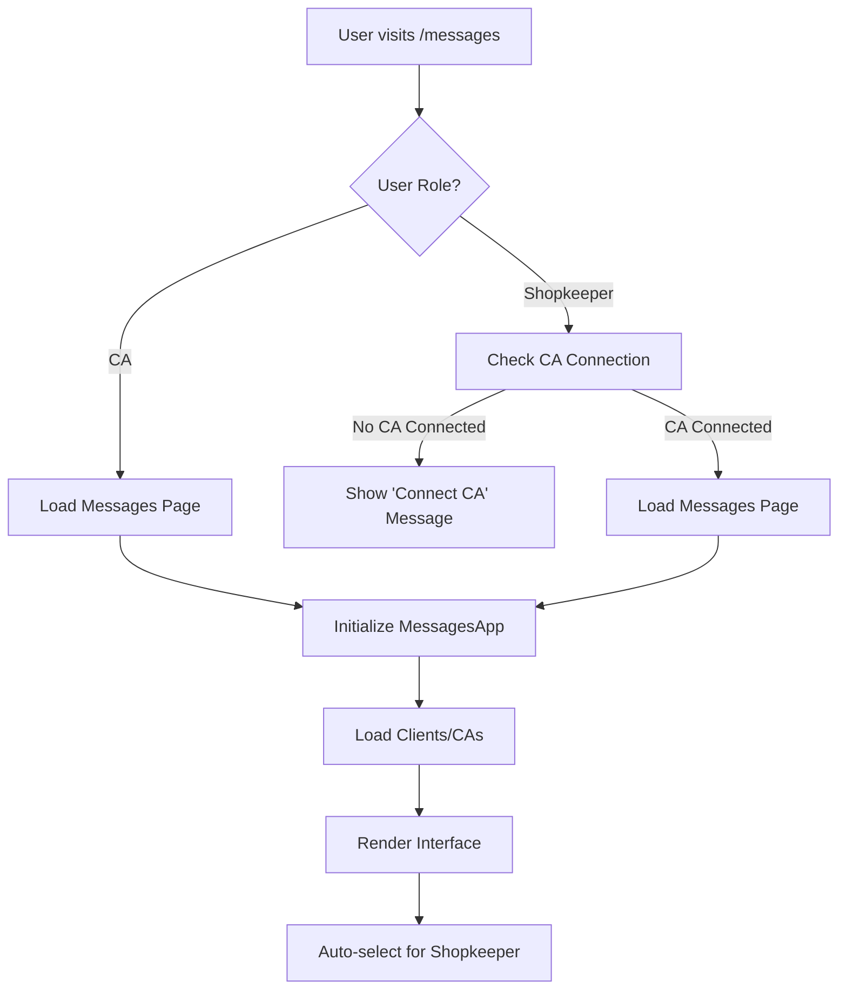
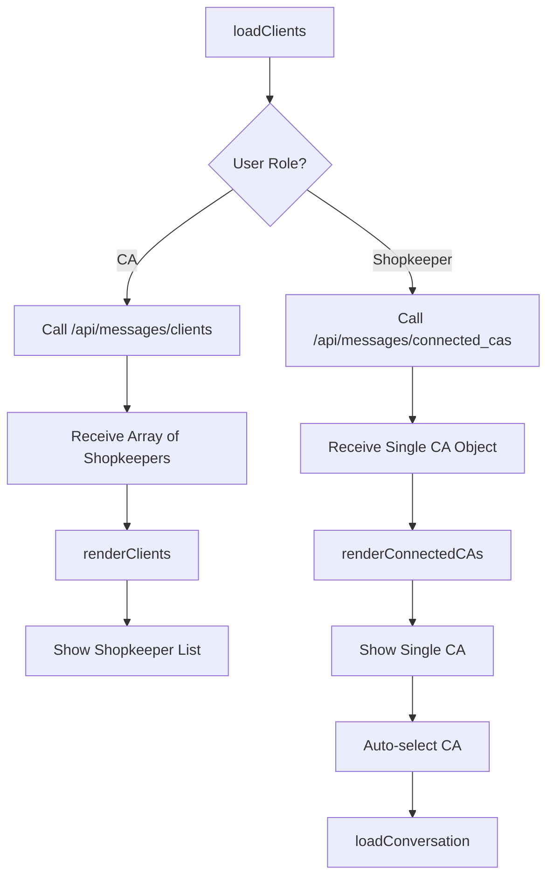
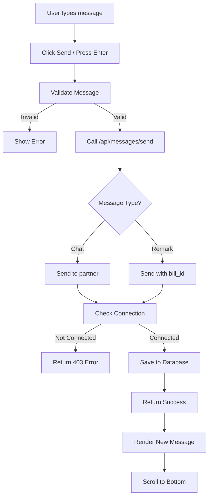
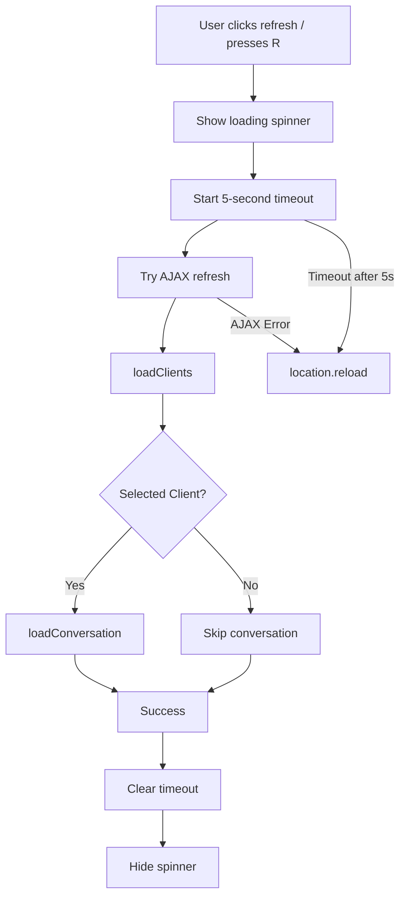
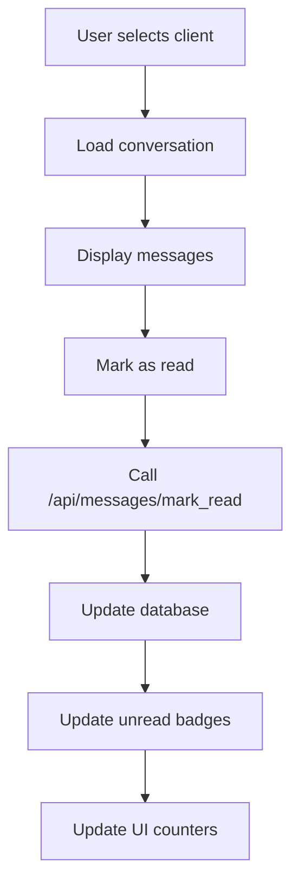

# Chat Module - Complete Flow Documentation

## 📋 Overview

The Chat Module enables real-time messaging between Chartered Accountants (CAs) and Shopkeepers in the MyBillingApp ecosystem. The system supports role-based messaging with different capabilities for each user type.

### Key Features
- **Role-Based Access**: CAs can chat with multiple connected shopkeepers, shopkeepers chat with their single connected CA
- **Real-time Interface**: WhatsApp-style messaging interface
- **Bill Remarks**: Special remark messages tied to specific bills
- **Manual Refresh**: User-controlled refresh with AJAX fallback to page reload
- **Unread Indicators**: Badge counters for unread messages
- **Auto-selection**: Shopkeepers automatically select their connected CA

---

## 📁 Files Involved

### Backend Files
- **`app/api/messages.py`** - API endpoints for messaging functionality
- **`app/shopkeeper/views/messages.py`** - Shopkeeper messages page route handler
- **`app/ca/views/messages.py`** - CA messages page route handler
- **`app/models.py`** - Database models (Message, User, Shopkeeper, CharteredAccountant, CAConnection)

### Frontend Files
- **`app/static/js/messages.js`** - Main JavaScript logic for messaging interface
- **`app/templates/shopkeeper/messages.html`** - Shopkeeper messages page template
- **`app/templates/ca/messages.html`** - CA messages page template

### Database Schema
- **`Complete Schema.sql`** - Contains messages table and related foreign keys

---

## 🛣️ Routes and API Endpoints

### Web Routes
| Route | Method | Handler | Description |
|-------|--------|---------|-------------|
| `/shopkeeper/messages` | GET | `shopkeeper.views.messages.messages()` | Shopkeeper messages page |
| `/ca/messages` | GET | `ca.views.messages.messages()` | CA messages page |

### API Endpoints
| Endpoint | Method | Access | Description |
|----------|--------|--------|-------------|
| `/api/messages/send` | POST | Authenticated | Send chat message or bill remark |
| `/api/messages/clients` | GET | CA Only | Get list of connected shopkeepers |
| `/api/messages/connected_cas` | GET | Shopkeeper Only | Get connected CA (single) |
| `/api/messages/conversation/<partner_id>` | GET | Authenticated | Get conversation with partner |
| `/api/messages/mark_read` | PATCH | Authenticated | Mark messages as read |
| `/api/messages/unread_count/<partner_id>` | GET | Authenticated | Get unread message count |

---

## 🔄 Complete Flow Logic

### 1. Page Load Flow



### 2. Client Loading Flow



### 3. Message Sending Flow



### 4. Refresh Logic Flow



### 5. Message Reading Flow



---

## 🎯 Role-Based Logic

### Chartered Accountant (CA) Logic
- **Multiple Clients**: Can chat with multiple connected shopkeepers
- **Client List**: Shows all approved connections with shopkeeper details
- **Selection**: Manual selection of which shopkeeper to chat with
- **Avatar Color**: Orange avatars for shopkeepers
- **API**: `/api/messages/clients` returns array of shopkeepers

### Shopkeeper Logic
- **Single CA**: Only one CA connected at a time
- **Auto-selection**: Automatically selects connected CA on page load
- **Simplified UI**: No client list, direct chat interface
- **Avatar Color**: Blue avatar for CA
- **API**: `/api/messages/connected_cas` returns single CA object or null

---

## 💾 Database Schema

### Messages Table
```sql
CREATE TABLE messages (
    message_id INT AUTO_INCREMENT PRIMARY KEY,
    sender_id VARCHAR(50) NOT NULL,
    receiver_id VARCHAR(50) NOT NULL,
    message TEXT NOT NULL,
    message_type ENUM('chat', 'remark') DEFAULT 'chat',
    bill_id INT NULL,
    read_status BOOLEAN DEFAULT FALSE,
    timestamp DATETIME DEFAULT CURRENT_TIMESTAMP,
    FOREIGN KEY (bill_id) REFERENCES bills(bill_id),
    INDEX idx_sender_receiver (sender_id, receiver_id),
    INDEX idx_timestamp (timestamp)
);
```

### Key Relationships
- **Messages**: Links users via sender_id/receiver_id (foreign keys to users.user_id)
- **CA Connections**: Links shopkeepers to CAs for permission checking
- **Bills**: Optional link for remark messages

---

## 🔧 JavaScript Architecture

### MessagesApp Object Structure
```javascript
const MessagesApp = {
    config: {
        userRole: 'CA' | 'shopkeeper',
        userId: null,
        selectedClientId: null,
        enablePolling: false, // Disabled to reduce server load
        pollFrequency: 60000
    },

    elements: {}, // DOM element cache

    // Core methods
    init(), loadClients(), selectClient(),
    loadConversation(), sendMessage(), refreshMessages(),

    // Role-specific methods
    loadCAClientList(), loadShopkeeperCAList(),
    renderClients(), renderConnectedCAs()
};
```

### Key Methods

#### `init(config)`
- Sets user role and configuration
- Caches DOM elements
- Calls `loadClients()` to populate interface

#### `loadClients()`
- Routes to role-specific loading method
- CA: `loadCAClientList()` → multiple shopkeepers
- Shopkeeper: `loadShopkeeperCAList()` → single CA

#### `refreshMessages()`
- Enhanced refresh with AJAX first, page reload fallback
- 5-second timeout prevents hanging requests
- Loading states provide user feedback

#### `selectClient(clientId, clientName)`
- Updates UI for selected conversation
- Loads message history
- Marks messages as read

---

## 🎨 UI Components

### CA Interface
- **Left Sidebar**: List of connected shopkeepers
- **Main Chat**: Selected shopkeeper conversation
- **Header**: Shopkeeper info + refresh button
- **Tabs**: Chat / Remarks toggle

### Shopkeeper Interface
- **Full Width Chat**: Direct conversation with connected CA
- **Header**: CA info + refresh button
- **Tabs**: Chat / Remarks toggle
- **No Sidebar**: Simplified for single CA

### Common Elements
- **Refresh Button**: Manual refresh with loading state
- **Message Input**: Auto-resize, character counter
- **Unread Badges**: Red counters on client items
- **Search**: Filter clients by name
- **Remark Modal**: Special bill remark interface

---

## 🚀 Performance Optimizations

### Server Load Reduction
- **Disabled Polling**: No automatic API calls every 5 seconds
- **Manual Refresh**: User-controlled data updates only
- **AJAX First**: Fast updates when possible, page reload fallback

### Database Optimizations
- **Indexes**: On sender/receiver combinations and timestamps
- **Unread Counts**: Efficient queries for badge updates
- **Pagination**: Limit conversation loading (50 messages)

### Frontend Optimizations
- **DOM Caching**: Elements cached on initialization
- **Event Delegation**: Efficient event handling
- **Loading States**: User feedback during operations

---

## 🔐 Security & Permissions

### Connection Validation
- **CA Connections**: Only approved connections allowed
- **Role Checking**: API endpoints validate user roles
- **Partner Verification**: Messages only between connected users

### Message Validation
- **Length Limits**: 2000 character maximum
- **Type Validation**: Only 'chat' or 'remark' allowed
- **Bill Verification**: Remarks require valid bill ownership

---

## 🐛 Error Handling

### API Error Responses
- **403 Forbidden**: Users not connected
- **404 Not Found**: Invalid partner or bill
- **400 Bad Request**: Invalid message data
- **500 Internal Error**: Database/server issues

### Frontend Error Handling
- **Network Errors**: Fallback to page reload on refresh
- **Validation Errors**: User-friendly error messages
- **Loading Timeouts**: 5-second fallback for refresh operations

---

## 📱 Mobile Responsiveness

### Responsive Design
- **Dual Views**: Desktop table + mobile card layouts
- **Input Handling**: Mobile disables desktop inputs to prevent duplicates
- **Touch Friendly**: Larger buttons and touch targets

### Mobile Optimizations
- **Keyboard Handling**: Proper viewport adjustments
- **Scroll Behavior**: Smooth scrolling to new messages
- **Loading States**: Mobile-friendly loading indicators

---

## 🔄 Future Enhancements

### Potential Features
- **Push Notifications**: Real-time message notifications
- **File Attachments**: Support for bill attachments
- **Message Search**: Search through conversation history
- **Typing Indicators**: Show when other user is typing
- **Message Reactions**: Like/acknowledge messages

### Performance Improvements
- **WebSocket Integration**: Real-time messaging
- **Message Caching**: Local storage for offline access
- **Lazy Loading**: Load older messages on scroll
- **Image Optimization**: Compress uploaded images

---

## 🧪 Testing Scenarios

### CA Testing
1. Connect multiple shopkeepers
2. Switch between conversations
3. Send chat messages and remarks
4. Test refresh functionality
5. Verify unread badge updates

### Shopkeeper Testing
1. Connect to CA
2. Auto-selection on page load
3. Send messages to CA
4. Test refresh with page reload fallback
5. Verify single CA constraint

### Error Testing
1. Network disconnection during refresh
2. Invalid message sending attempts
3. Permission violations
4. Database connection issues

---

*This documentation covers the complete chat module implementation with role-based messaging, enhanced refresh logic, and comprehensive error handling.*