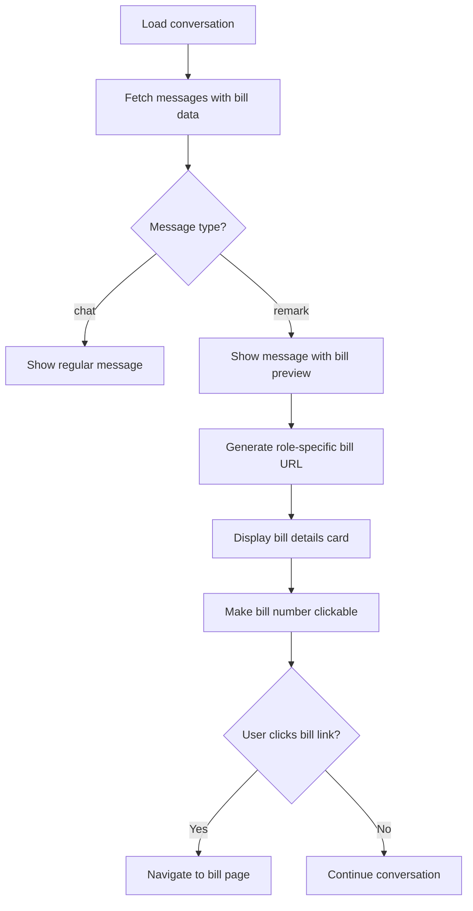
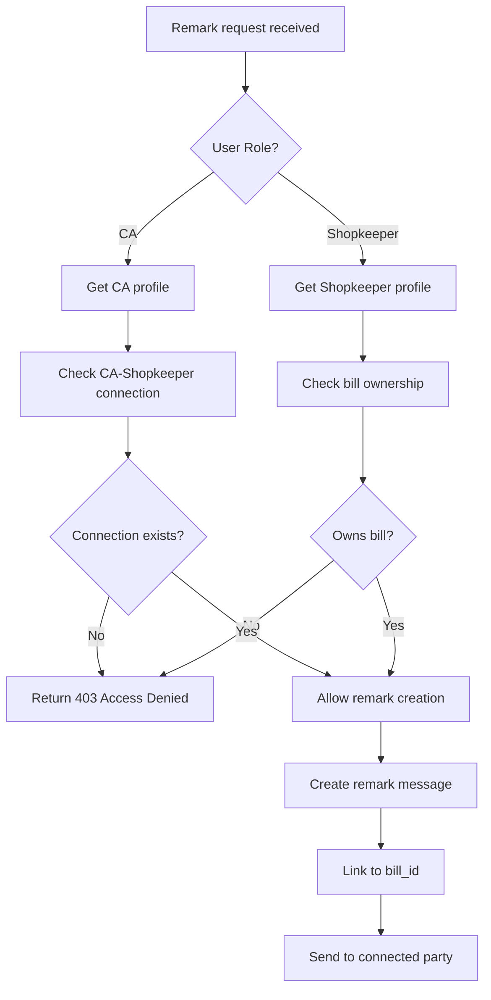

# Remark System - Complete Logic & Implementation

## 📋 Overview

The Remark System enables CAs and Shopkeepers to add contextual remarks to specific bills, creating a threaded conversation tied to billing transactions. This enhances the messaging system by providing bill-specific communication.

### Key Features
- **Bill-Specific Remarks**: Remarks are tied to specific bills with full bill context
- **Role-Based Access**: Both CAs and shopkeepers can add remarks to bills they have access to
- **Visual Bill Previews**: Remark messages show bill details and clickable links
- **Modal Interface**: Clean popup interface for remark creation
- **Message Threading**: Remarks appear in the messaging system with bill context

---

## 🔄 Remark Flow Logic

### 1. Remark Creation Flow

```mermaid
graph TD
    A[User views bill page] --> B[Clicks 'Add Remark' button]
    B --> C[Remark modal opens]
    C --> D[User types remark text]
    D --> E[User clicks 'Send Remark']
    E --> F{User Role?}
    
    F -->|CA| G[POST to /ca/bills/{id}/remark]
    F -->|Shopkeeper| H[POST to /shopkeeper/bills/{id}/remark]
    
    G --> I[Verify CA has access to bill]
    H --> J[Verify shopkeeper owns bill]
    
    I --> K[Find connected shopkeeper]
    J --> L[Find connected CA]
    
    K --> M[Create message with bill_id]
    L --> M
    
    M --> N[Save to database]
    N --> O[Return success]
    O --> P[Close modal & refresh messages]
```

### 2. Remark Display Flow



### 3. Access Control Flow



---

## 📁 Files Modified & Created

### Backend Files

#### **1. `app/shopkeeper/views/messages.py`**
**Purpose**: Added remark endpoint for shopkeepers
**Changes**:
- Added `/bills/<int:bill_id>/remark` POST route
- Implemented shopkeeper-to-CA remark functionality
- Added bill ownership verification
- Added CA connection validation

#### **2. `app/ca/views/messages.py`** 
**Purpose**: CA remark endpoint (already existed)
**Status**: Used existing endpoint with same pattern

#### **3. `app/api/messages.py`**
**Purpose**: Enhanced message API for bill context
**Changes**:
- Enhanced conversation endpoint to include bill details
- Added bill relationship data in message responses
- Enhanced connected CA endpoint for shopkeepers

### Frontend Files

#### **4. `app/static/js/messages.js`**
**Purpose**: Main messaging interface logic
**Changes**:
- Updated `submitRemark()` to use role-specific endpoints
- Enhanced `renderMessage()` to show bill previews for remarks
- Added role-based bill URL generation
- Fixed bill link routing for both roles

#### **5. `app/templates/shopkeeper/bill_receipt.html`**
**Purpose**: Shopkeeper bill page template
**Changes**:
- Added remark button for shopkeepers (was CA-only)
- Added remark modal HTML structure
- Enhanced JavaScript for role-specific remark submission
- Added proper event listeners and character counting

#### **6. `app/templates/ca/messages.html` & `app/templates/shopkeeper/messages.html`**
**Purpose**: Message interface templates
**Status**: Already had remark functionality, enhanced with refresh buttons

### Database Schema

#### **7. Messages Table** (already existed)
```sql
CREATE TABLE messages (
    id INT AUTO_INCREMENT PRIMARY KEY,
    sender_id VARCHAR(50) NOT NULL,
    receiver_id VARCHAR(50) NOT NULL,
    message TEXT NOT NULL,
    message_type ENUM('chat', 'remark') DEFAULT 'chat',
    bill_id INT NULL,
    timestamp DATETIME DEFAULT CURRENT_TIMESTAMP,
    read BOOLEAN DEFAULT FALSE,
    FOREIGN KEY (bill_id) REFERENCES bills(bill_id)
);
```

---

## 🎯 Implementation Details

### 1. Role-Based Endpoints

#### **Shopkeeper Remark Endpoint**
```python
# File: app/shopkeeper/views/messages.py
@bp.route('/bills/<int:bill_id>/remark', methods=['POST'])
@login_required
@shopkeeper_required
def add_bill_remark(bill_id):
    # 1. Validate bill ownership
    # 2. Find connected CA
    # 3. Create remark message
    # 4. Return success response
```

#### **CA Remark Endpoint**
```python
# File: app/ca/views/messages.py  
@bp.route('/bills/<int:bill_id>/remark', methods=['POST'])
@login_required
def add_bill_remark(bill_id):
    # 1. Validate CA access to bill
    # 2. Find bill's shopkeeper
    # 3. Create remark message
    # 4. Return success response
```

### 2. Frontend Integration

#### **Role-Specific URL Generation**
```javascript
// In messages.js - Bill links in messages
const billUrl = this.config.userRole === 'CA' 
    ? `/ca/bill/${message.bill.id}` 
    : `/shopkeeper/bill/${message.bill.id}`;

// Remark submission endpoints
const remarkUrl = this.config.userRole === 'CA' 
    ? `/ca/bills/${billId}/remark`
    : `/shopkeeper/bills/${billId}/remark`;
```

#### **Bill Preview in Messages**
```javascript
// Enhanced message rendering with bill context
if (message.bill && message.message_type === 'remark') {
    billPreview = `
        <div class="bill-preview mt-2 p-3 bg-gray-50 rounded-lg border">
            <a href="${billUrl}" class="text-orange-600 hover:text-orange-700 font-medium">
                📄 View Bill #${message.bill.bill_number}
            </a>
            <p class="text-sm text-gray-600 mt-1">
                ₹${message.bill.total_amount} • ${billDate}
            </p>
        </div>
    `;
}
```

### 3. Modal Interface

#### **Unified Remark Modal**
```html
<!-- Available for both CA and Shopkeeper -->

<div id="remark-modal" class="fixed inset-0 backdrop-blur-sm hidden">
    <!-- Modal content with bill info and remark textarea -->
</div>

```

#### **JavaScript Event Handling**
```javascript
// Role-specific remark submission
async function submitRemark() {
    const userRole = '{{ current_user.role }}';
    const remarkUrl = userRole === 'CA' 
        ? `/ca/bills/${currentBillData.id}/remark`
        : `/shopkeeper/bills/${currentBillData.id}/remark`;
    
    const response = await fetch(remarkUrl, {
        method: 'POST',
        headers: { 'Content-Type': 'application/json' },
        body: JSON.stringify({ remark_text: message })
    });
}
```

---

## 🔐 Security & Validation

### 1. Access Control
- **Bill Ownership**: Shopkeepers can only remark on their own bills
- **CA Connections**: CAs can only remark on bills from connected shopkeepers
- **Role Verification**: Endpoints verify user roles before processing
- **Connection Validation**: Ensures CA-Shopkeeper relationship exists

### 2. Data Validation
- **Text Length**: Maximum 2000 characters for remarks
- **Required Fields**: Validates remark text presence
- **Bill Existence**: Verifies bill exists before creating remark
- **User Authentication**: Requires login for all remark operations

### 3. Database Integrity
- **Foreign Keys**: Links remarks to bills and users properly
- **Transaction Safety**: Uses database transactions with rollback
- **Indexes**: Optimized queries for bill-message relationships

---

## 🎨 User Experience

### 1. Visual Design
- **Bill Previews**: Contextual cards showing bill details in messages
- **Color Coding**: Orange theme for remark-related UI elements  
- **Responsive Design**: Works on desktop and mobile
- **Loading States**: Shows progress during remark submission

### 2. Navigation
- **Smart Routing**: Bill links open in appropriate role context
- **Modal Interface**: Non-intrusive popup for remark creation
- **Tab Integration**: Remarks appear in separate tab in messages
- **Auto-refresh**: Messages update after remark submission

### 3. Feedback
- **Success Messages**: Confirms when remarks are sent
- **Error Handling**: Clear error messages for failures
- **Character Counting**: Real-time feedback on text length
- **Visual Indicators**: Shows remark messages with distinct styling

---

## 🚀 Usage Scenarios

### 1. CA Adding Remark
1. CA views bill from connected shopkeeper
2. Clicks "Add Remark" button
3. Types remark about GST calculation or compliance
4. Submits remark - goes to shopkeeper's message inbox
5. Shopkeeper sees remark with bill context in messages

### 2. Shopkeeper Adding Remark  
1. Shopkeeper views their own bill
2. Clicks "Add Remark" button
3. Types question about tax treatment or payment
4. Submits remark - goes to connected CA's message inbox
5. CA sees remark with full bill details

### 3. Bill Context Navigation
1. User sees remark message in conversation
2. Clicks on bill number in remark preview
3. Navigates to appropriate bill page based on role
4. Can add follow-up remarks from bill page
5. Creates threaded conversation around specific bill

---

## 📊 Technical Benefits

### 1. Modular Architecture
- **Separation of Concerns**: Role-specific endpoints and logic
- **Reusable Components**: Modal and message rendering work for both roles
- **Clean URLs**: RESTful patterns for remark endpoints
- **Template Inheritance**: Consistent UI across roles

### 2. Performance
- **Efficient Queries**: Proper indexing on bill-message relationships
- **Lazy Loading**: Bill details loaded only when needed
- **Client-side Routing**: Fast navigation between bills and messages
- **Caching**: Static assets cached for faster loading

### 3. Maintainability  
- **Consistent Patterns**: Same logic flow for both CA and shopkeeper
- **Error Handling**: Comprehensive error catching and reporting
- **Debug Support**: Logging for troubleshooting issues
- **Documentation**: Clear code comments and function documentation

---

## 🔄 Future Enhancements

### Potential Improvements
1. **File Attachments**: Allow attaching documents to remarks
2. **Remark Threading**: Reply to specific remarks 
3. **Notification System**: Real-time alerts for new remarks
4. **Remark Categories**: Tag remarks by type (payment, GST, general)
5. **Search Functionality**: Search remarks by bill or content
6. **Remark Templates**: Pre-defined common remark templates
7. **Audit Trail**: Track remark edits and deletions
8. **Bulk Remarks**: Add remarks to multiple bills at once

### Technical Improvements
1. **WebSocket Integration**: Real-time remark notifications
2. **Rich Text Editor**: Formatted text in remarks
3. **Image Support**: Screenshot attachments for visual context
4. **Mobile App**: Native mobile interface for remarks
5. **API Rate Limiting**: Prevent spam remarks
6. **Analytics**: Track remark patterns and response times

---

*This documentation covers the complete remark system implementation with role-based access, bill context integration, and comprehensive user experience design.*